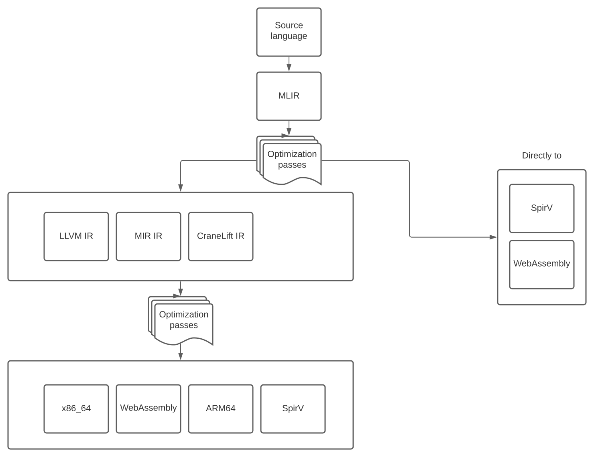

# wika
wika is tool to build languages on the web

# This tool is currently in the planning stages.

### Requirements
* Fast to iterate on every aspect of the language, including the grammar, lexer, parser, dialect, code generator
* Possible to acheive high performance with the language (think C,C++,Rust)
* Keep every stage of compilation in memory, to avoid disk IO cost. From source language to the final target language
* Can setup multiple conversion paths
* Can add optimization passes to any step
* Can compile to multiple targets including (spirv, wasm, x86-64, ARM64)

### Tools considering to use for this project
* MLIR - this one seems like the obvious choice for the initial target for the source language
* LLVM - this one can further optimize to machine code and WASM
* CraneLift - as an alternitive to LLVM, to speed up compilation and reduce compiler code bloat
* MIR - as an alternitive to LLVM, to speed up compilation and reduce compiler code bloat

### Questions
* Does it make sense to compile to dynamic (lua? typescript?)

### Ideas of how it could work


```
function ::= def '(' [parlist] ')' [block]
    visit  -> emitMLIR(...)
    error_not(')') -> print('Bad syntax; Did you forget ')'?')

block ::= `{´ [statement] `}´
    error_not('}') -> print('Bad syntax; Did you forget '}'?')

<IP Address> ::= <NODE> "." <NODE> “.” <NODE> “.” <NODE>
    error_not(<NODE>) -> print('Bad syntax; <NODE> should be between 0 and 255')

<NODE> ::= 000 to 255
```
